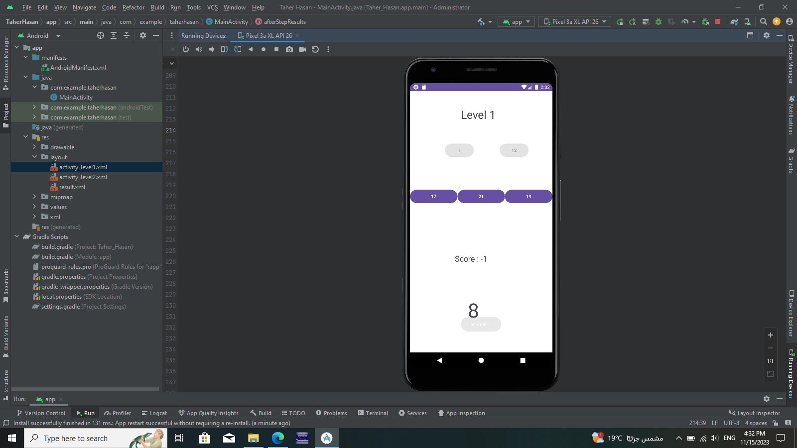
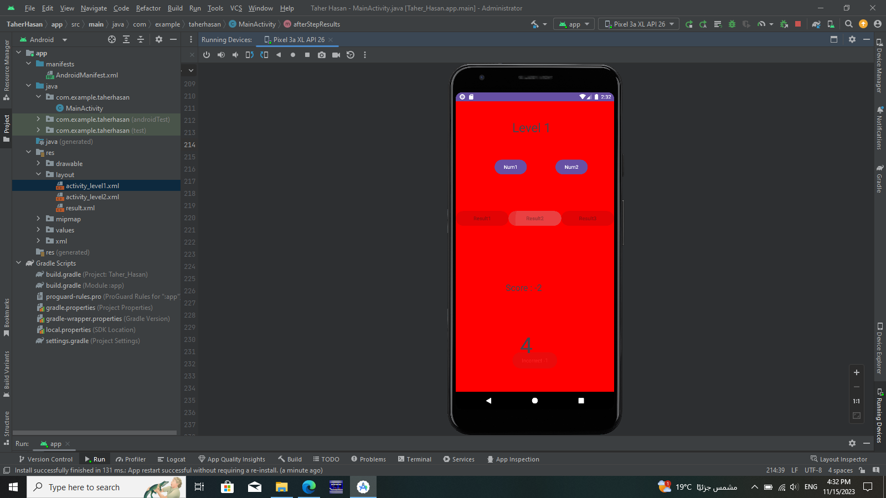
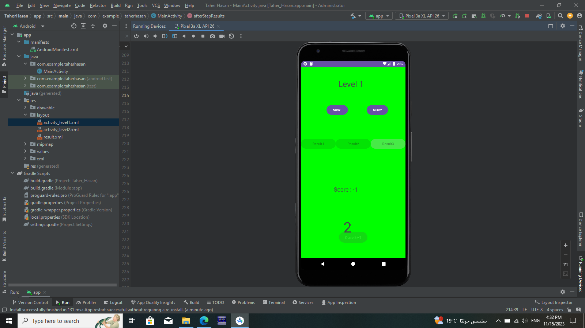
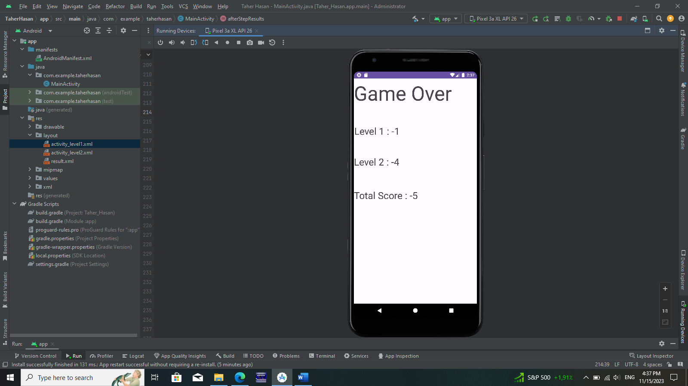

# Simple Math Game

## Overview

This is a simple Android game that challenges the player's basic math skills. The game consists of three levels: Level 1, Level 2, and the Result screen.

## Level 1

1. Two buttons, `num1` and `num2`, are placed near each other.
2. Three buttons in a row: `result1`, `result2`, and `result3`.
3. Text view to display the score.
4. Generate random numbers in `num1` and `num2` between 0 and 20.
5. Add the two numbers.
6. Place the result on one of the three result buttons randomly.
7. The other two buttons should contain random values not equal to the result (within +/- 2).
8. Random numbers (for `num1` and `num2`) are generated when the app starts and every time the user answers.
9. Increment `score1` for each correct answer and decrement the score for each incorrect answer.
10. Display a message for every correct/incorrect answer ("Correct" or "Incorrect").

## Level 2

1. Similar to Level 1 but with numbers between 0 and 100.
2. The operation is subtraction.
3. Wrong answers are within (+/- 3).
4. Level 2 has its own score (`score2`).

## Result Screen

1. After 60 seconds in Level 1, the game transitions to Level 2.
2. After another 60 seconds in Level 2, the game transitions to the Result screen.
3. The Result screen displays the results of each level and the total score.

## Implementation Details

- The game is implemented in Android Studio using Java.
- Use XML layouts to design the UI.
- Utilize a `Handler` or other mechanisms to handle timing transitions between levels.
- Display messages using `Toast` for correct/incorrect answers.

## Result Screen

1. After 60 seconds in Level 1, the game transitions to Level 2.
2. After another 60 seconds in Level 2, the game transitions to the Result screen.
3. The Result screen displays the results of each level and the total score.

### Example Images:

